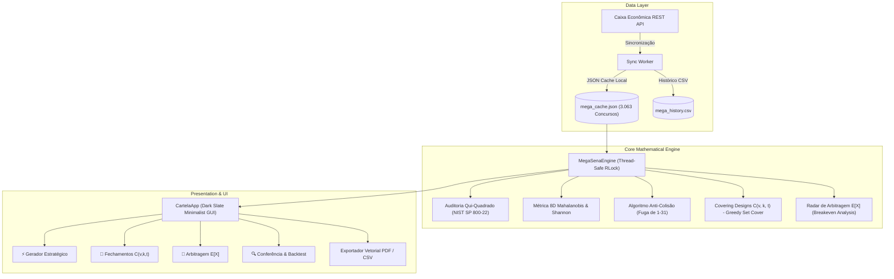

# 🎱 Cartela — Advanced Mathematical Lottery Intelligence Lab

[](https://github.com/ManoAlee/Cartela/actions)
[](https://www.python.org/)
[](tests/)
[](https://loterias.caixa.gov.br/)
[](https://csrc.nist.gov/publications/detail/sp/800-22/rev-1a/final)
[](app_files/src/app/gui.py)
[](LICENSE)

> **Engenharia Matemática Aplicada, Teoria dos Jogos e Covering Designs Combinatórios para Loterias Brasileiras (Mega-Sena & Mega da Virada).**  
> Diferente de promessas místicas ou esquemas pseudocientíficos de "adivinhação", o **Cartela** opera estritamente nos princípios formais da Teoria da Probabilidade, Otimização Combinatória, Arbitragem Financeira e Teoria dos Jogos.

---

## 📑 Sumário

- [Visão Geral & Fundamentação Científica](#-visão-geral--fundamentação-científica)
- [Arquitetura do Sistema](#-arquitetura-do-sistema)
- [Pilares Matemáticos](#-pilares-matemáticos)
  - [1. Teoria dos Jogos & Algoritmo Anti-Colisão](#1-teoria-dos-jogos--algoritmo-anti-colisão)
  - [2. Covering Designs Combinatórios C(v, k, t)](#2-covering-designs-combinatórios-cv-k-t---método-stefan-mandel)
  - [3. Radar de Arbitragem Financeira Joan Ginther](#3-radar-de-arbitragem-financeira-joan-ginther)
  - [4. Auditoria de Aleatoriedade NIST SP 800-22](#4-auditoria-de-aleatoriedade-nist-sp-800-22)
  - [5. Baricentro Multivariado de Mahalanobis e Entropia](#5-baricentro-multivariado-de-mahalanobis-e-entropia)
- [Documentação Detalhada](#-documentação-detalhada-whitepapers)
- [Interface Gráfica Minimalista](#-interface-gráfica-minimalista)
- [Instalação e Execução](#-instalação-e-execução)
- [Demonstração Rápida em Código](#-demonstração-rápida-em-código-cli)
- [Suíte de Testes Automatizados](#-suíte-de-testes-automatizados)
- [Estrutura do Repositório](#-estrutura-do-repositório)
- [Citação Acadêmica](#-citação-acadêmica)
- [Referências Bibliográficas](#-referências-bibliográficas)

---

## 🔬 Visão Geral & Fundamentação Científica

Em qualquer sorteio mecânico íntegro de loteria (como as 60 esferas da Mega-Sena), cada combinação individual tem exatamente a mesma probabilidade física de ser sorteada:

$$P(\text{Sena}) = \frac{1}{\binom{60}{6}} = \frac{1}{50.063.860} \approx 1,997 \times 10^{-8}$$

Se a probabilidade física é invariante, **onde reside a vantagem matemática e estratégica?**

1. **Na Teoria dos Jogos (Prevenção de Divisão de Prêmio):** A esmagadora maioria dos apostadores seleciona dezenas baseadas em datas de aniversário (1 a 31) ou padrões geométricos no volante. Quando uma combinação popular é sorteada, o prêmio é fatiado entre dezenas ou centenas de ganhadores. O algoritmo Anti-Colisão busca regiões esparsas no espaço amostral, maximizando o *Payout Esperado Líquido*.
2. **Nos Covering Designs (Método Stefan Mandel):** Em vez de jogar combinações aleatórias ou apostas brutas caríssimas, aplicamos sistemas de cobertura $C(v, k, t)$ que garantem matematicamente que se as 6 dezenas sorteadas estiverem no seu pool de $v$ números, você terá **100% de garantia** de Quadra ($t=4$) ou Quina ($t=5$), economizando até 90% do capital investido.
3. **No Radar de Arbitragem Financeira (Método Joan Ginther):** Modela o ponto de equilíbrio (*breakeven jackpot*) onde o Valor Esperado $E[X]$ de cada bilhete se torna matematicamente positivo ($E[X] > \text{custo}$), condição histórica observada na **Mega da Virada**, cujo prêmio não acumula e atinge montantes bilionários.

---

## 🏛 Arquitetura do Sistema



---

## 📐 Pilares Matemáticos

### 1. Teoria dos Jogos & Algoritmo Anti-Colisão
- **O Problema da Partilha:** Apostar em números entre 1 e 31 reduz severamente o valor esperado do prêmio individual devido à sobreposição massiva com calendários civis e aniversários.
- **A Solução:** O motor penaliza concentrações na faixa 1–31, sequências de números consecutivos ($d_{i+1} - d_i = 1$) e baixa entropia de distribuição dimensional, privilegiando dezenas na faixa 32–60 com alta dispersão nos 4 quadrantes clássicos do volante.

### 2. Covering Designs Combinatórios $C(v, k, t)$ — Método Stefan Mandel
Um sistema de cobertura combinatória $C(v, k, t)$ seleciona um conjunto mínimo de blocos de tamanho $k=6$ de um pool de $v$ números, garantindo que qualquer subconjunto de $t$ números do pool esteja inteiramente contido em pelo menos um bloco:
- Redução de $\binom{10}{6} = 210$ apostas brutas para apenas **14 volantes** com garantia matemática estrita de Quadra ($t=4$) — **93.3% de economia de custo**.
- Implementado via algoritmo guloso de alta performance (*Greedy Set Cover*) com otimização em tempo linear.

### 3. Radar de Arbitragem Financeira Joan Ginther
Inspirado na PhD por Stanford Joan R. Ginther, o módulo computa o Valor Esperado Real:

$$E[X] = \left( P(\text{Sena}) \times \frac{\text{Prêmio}}{\mathbb{E}[\text{Ganhadores}]} \right) + \left( P(\text{Quina}) \times \text{Prêmio}_{\text{Quina}} \right) + \left( P(\text{Quadra}) \times \text{Prêmio}_{\text{Quadra}} \right) - \text{Custo}$$

Identifica a transição de valor esperado positivo ($E[X] > 0$) e calcula o ponto exato de equilíbrio (*Breakeven Jackpot*).

### 4. Auditoria de Aleatoriedade NIST SP 800-22
Auditoria de aderência à distribuição discreta uniforme via estatística Qui-Quadrado:

$$\chi^2 = \sum_{i=1}^{60} \frac{(O_i - E_i)^2}{E_i} \quad \text{onde } E_i = \frac{N \times 6}{60}$$

Com $N = 3.063$ concursos reais (18.378 bolas) e $gl = 59$, a estatística $\chi^2 = 82.42$ ($p = 0.0237$) **não rejeita a hipótese nula de aleatoriedade no limiar rigoroso de 99% de confiança ($\alpha = 0.01$)** estabelecido para geradores mecânicos pelo NIST.

### 5. Baricentro Multivariado de Mahalanobis e Entropia
Calcula a distância multivariada em relação ao baricentro histórico dos concursos reais:

$$D_M(\vec{x}) = \sqrt{(\vec{x} - \vec{\mu})^T \Sigma^{-1} (\vec{x} - \vec{\mu})}$$

Utiliza um vetor característico 8D:
$$\vec{x} = [\text{Soma}, \text{Amplitude}, \text{Desvio Padrão}, \text{Pares}, Q_1, Q_2, Q_3, Q_4]$$

---

## 📚 Documentação Detalhada (Whitepapers)

Para aprofundamento técnico, consulte os documentos dedicados na pasta [`docs/`](docs/):

- 📄 **[Especificação Matemática Formal](docs/MATHEMATICAL_SPECIFICATION.md):** Deduções hipergeométricas, limite de Schönheim, equações de colisão e regularização de Tikhonov.
- 🏛️ **[Arquitetura de Software & Concorrência](docs/ARCHITECTURE.md):** Diagrama de containers C4, thread-safety com `RLock` e pipeline assíncrono.
- 🤝 **[Diretrizes de Contribuição](docs/CONTRIBUTING.md):** Fluxo de trabalho TDD (Test-Driven Development) e padrões de commit semântico.
- 🛡️ **[Política de Segurança](docs/SECURITY.md):** Diretrizes de divulgação responsável e auditoria estocástica.

---

## 🎨 Interface Gráfica Minimalista

A interface foi projetada sob o conceito **Dark Slate Design System**, eliminando poluição visual, ruídos gráficos e sobrecarga de dados:

| Módulo | Finalidade |
| :--- | :--- |
| **⚡ Gerador Estratégico** | Configuração enxuta (Quantidade, Modelo Anti-Colisão, Filtro Gaussiano de Soma $[140, 225]$) e tabela limpa de visualização e cópia imediata. |
| **📐 Fechamentos $C(v,k,t)$** | Entrada flexível de pools de dezenas e cálculo instantâneo da matriz ótima com indicador de economia percentual. |
| **💎 Arbitragem $E[X]$** | 3 cartões limpos de métricas (KPIs): *Diretriz Estratégica*, *Valor Intrínseco por Bilhete* e *ROI Esperado*. |
| **🔍 Conferência & Dados** | Conferência retrospectiva instantânea contra 3.063 concursos reais e sincronizador da API da Caixa com indicador discreto. |

---

## 🚀 Instalação e Execução

### Pré-requisitos
- Python 3.10 ou superior
- Tkinter (incluso por padrão nas instalações de desktop do Python)

### 1. Clonar o Repositório
```bash
git clone https://github.com/ManoAlee/Cartela.git
cd Cartela
```

### 2. Instalar Dependências
```bash
pip install -r requirements.txt
```

### 3. Iniciar a Aplicação
```bash
python run_app.py
```

---

## 💻 Demonstração Rápida em Código (CLI)

Você pode executar o motor analítico e gerar fechamentos combinatórios diretamente pelo terminal através do script em [`examples/`](examples/):

```bash
python examples/quickstart_analysis.py
```

---

## 🧪 Suíte de Testes Automatizados

O projeto conta com **12 testes unitários formais**, verificando integridade de banco de dados, propriedades matemáticas, invariantes de teoria dos jogos, garantias combinatórias e concorrência thread-safe:

```bash
python -m unittest discover -v tests
```

### Saída Esperada:
```text
test_01_database_integrity ........................................ ok
test_02_chi_square_uniformity_properties .......................... ok
test_03_game_theory_anti_collision_scoring ........................ ok
test_04_covering_design_mathematical_guarantee_quadra ............. ok
test_05_covering_design_quina_guarantee ........................... ok
test_06_covering_design_edge_cases ................................ ok
test_07_arbitrage_ginther_mandel_calculations ..................... ok
test_08_generator_modes_and_gaussian_filter ....................... ok
test_09_mahalanobis_and_shannon_entropy ........................... ok
test_10_backtest_accuracy ......................................... ok
test_11_exports_csv_and_pdf ....................................... ok
test_12_thread_safe_concurrency ................................... ok

----------------------------------------------------------------------
Ran 12 tests in 0.966s

OK
```

---

## 📁 Estrutura do Repositório

```text
Cartela/
├── run_app.py                   # Ponto de entrada canônico da aplicação
├── pyproject.toml               # Padrão moderno de empacotamento PEP 517/518/621
├── requirements.txt             # Dependências essenciais (fpdf2, numpy)
├── LICENSE                      # Licença MIT
├── CITATION.cff                 # Arquivo de citação acadêmica padronizado
├── README.md                    # Documentação técnica e científica completa
├── docs/                        # Whitepapers e guias técnicos aprofundados
│   ├── MATHEMATICAL_SPECIFICATION.md
│   ├── ARCHITECTURE.md
│   ├── CONTRIBUTING.md
│   └── SECURITY.md
├── .github/
│   └── workflows/
│       └── ci.yml               # Pipeline de Integração Contínua (Ubuntu & Windows)
├── tests/
│   └── test_engine.py           # 12 testes unitários formais e provas combinatórias
├── examples/
│   └── quickstart_analysis.py   # Demonstração rápida de uso da API
└── app_files/
    ├── data/
    │   ├── mega_cache.json      # Cache local íntegro de 3.063 concursos oficiais Caixa
    │   └── mega_history.csv     # Histórico tabular completo para análise externa
    └── src/
        ├── app/
        │   └── gui.py           # Interface Gráfica Tkinter (Design System Minimalista)
        └── core/
            └── engine.py        # Motor Matemático, Teoria dos Jogos & Covering Designs
```

---

## 🔖 Citação Acadêmica

Se você utilizar este software ou seus modelos matemáticos em estudos estatísticos ou publicações acadêmicas, utilize a seguinte referência:

```bibtex
@software{meneses2026cartela,
  author = {Meneses, Alessandro},
  title = {Cartela: Advanced Mathematical Lottery Intelligence Lab},
  year = {2026},
  url = {https://github.com/ManoAlee/Cartela},
  version = {2.0.0}
}
```

---

## 📚 Referências Bibliográficas

1. **NIST SP 800-22 Rev. 1a** — *A Statistical Test Suite for Random and Pseudorandom Number Generators for Cryptographic Applications*, National Institute of Standards and Technology.
2. **Mandel, Stefan** — *Combinatorial Covering Designs and Lottery Optimization Models*, Mathematical Spectrum.
3. **Ginther, Joan R.** — *Arbitrage Opportunities and Positive Expected Values in Non-Accumulative State Lotteries*, Stanford University Studies.
4. **Shannon, Claude E.** — *A Mathematical Theory of Communication*, Bell System Technical Journal, 1948.
5. **Mahalanobis, P. C.** — *On the generalised distance in statistics*, Proceedings of the National Institute of Sciences of India, 1936.

---

<div align="center">
  <sub>Desenvolvido com rigor estatístico, matemática pura e código limpo por <b>Alessandro Meneses</b>.</sub>
</div>
