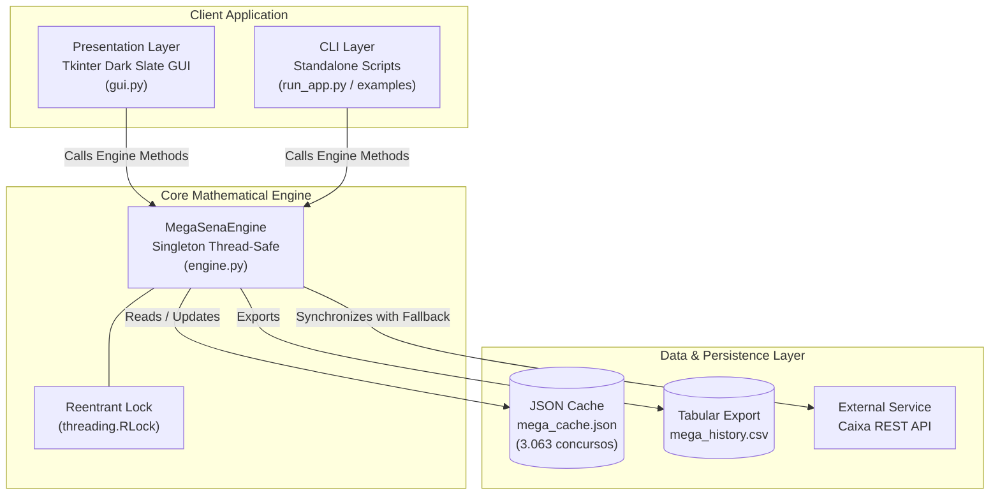

# 🏛 Arquitetura de Software & Design System

Este documento detalha as decisões arquiteturais, padrões de engenharia e diretrizes de concorrência implementadas no **Cartela**.

---

## 1. Visão Modular C4 (Level 2 — Containers)



---

## 2. Padrões de Concorrência & Thread-Safety

A interface gráfica executa operações pesadas (como requisições HTTP à API da Caixa e cálculos de cobertura combinatória) em segundo plano através de instâncias de `threading.Thread(daemon=True)`.

### Blindagem de Concorrência:
- O motor `MegaSenaEngine` utiliza um **Reentrant Lock (`threading.RLock`)** interno.
- Leituras aos arrays de concursos, recalibração da matriz de covariância e escritas no arquivo de cache local são atomicamente protegidas.
- A interface de usuário agenda mutações visuais de forma segura e síncrona.

---

## 3. Estrutura de Diretórios Padronizada

```text
Cartela/
├── run_app.py                   # Ponto de entrada canônico
├── pyproject.toml               # Padrão PEP 517/518/621
├── requirements.txt             # Dependências de produção
├── LICENSE                      # Licença MIT
├── CITATION.cff                 # Metadados para citação científica
├── README.md                    # Documentação principal
├── docs/
│   ├── MATHEMATICAL_SPECIFICATION.md # Whitepaper matemático formal
│   ├── ARCHITECTURE.md          # Arquitetura e concorrência
│   ├── CONTRIBUTING.md          # Guia de contribuição e TDD
│   └── SECURITY.md              # Política de segurança
├── .github/
│   └── workflows/
│       └── ci.yml               # CI Pipeline multiplataforma
├── tests/
│   └── test_engine.py           # 12 testes unitários formais
├── examples/
│   └── quickstart_analysis.py   # Script rápido de demonstração
└── app_files/
    ├── data/                    # Base de dados oficial da Caixa
    └── src/
        ├── app/                 # Camada gráfica (Tkinter)
        └── core/                # Motor estatístico e combinatório
```
